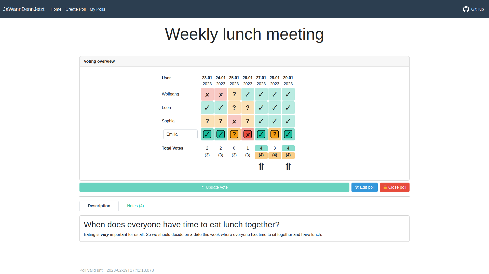

# JaWannDennJetzt



This project aims to address one of mankinds toughest challenges to date: **Scheduling a date for a group of people.**

Taking inspiration from the similarly named project **_JaWannDenn_** (German for _'So, when is it gonna be?'_), we started from scratch and built **_JaWannDennJetzt_** (German for _'So, when is it **finally** gonna be?!'_).
It provides a useful poll creation tool to help tackle the above problem. Polls can be created and shared within seconds, while users can respond to them just as quickly\*. Should anything come up and a vote needs updating, the user can simply update their vote. Once all votes are in, the final result can be chosen from an easy to read vote overview.
This makes the entire scheduling process simple, quick and as straightforward as possible.

\*_theoretically, if the stars align and they already know their schedule_

# Running / Deploying via docker compose

We do not provide pre-built docker images because some configuration options are used at build time (the theme, for instance). However, building and running the docker images is fairly straightforward with docker compose:

First, clone this repository and copy the [`example.env`](/example.env) in the root directoy to a `.env` file (also in the root directry). Then adjust the configuration options. See [Configuration](#configuration) for more information.

The variables defined in the `.env` file can be overwritten with environment variables. However, this is not recommended since the variables should be identical both at build- and runtime.

---

JaWannDennJetzt currently supports two database engines: SQLite3 and PostgreSQL. Depending on which engine you have chosen, use the corresponding `docker-compose.*.yaml` file as a template for your `docker-compose.yaml`. If you are fine with the defaults, no further configuration should be required.

Now, you can use this command to build and run JaWannDennJetzt:

```bash
docker compose up --build
```

## Configuration

JaWannDennJetzt supports the following configuration options:

| Option                    | Description                                                                                                                                          |
| ------------------------- | ---------------------------------------------------------------------------------------------------------------------------------------------------- |
| `SECRET_KEY`              | The [Django secret key](https://docs.djangoproject.com/en/4.1/ref/settings/#secret-key). This value **MUST** be changed!                             |
| `DEBUG`                   | Whether to run in debug mode. **DO NOT ENABLE THIS FOR PRODUCTION**                                                                                  |
| `NODE_ENV`                | Should be set to `production` when running in a production environment                                                                               |
| `JWDJ_SUBPATH`            | Prefix from which the app should be served (default is "/"). A common use-case for such a setup is serving multiple applications on the same domain. |
| `JWDJ_THEME`              | Which theme from [Bootswatch](https://bootswatch.com) to                                                                                             |
| `JWDJ_SERVE_STATIC_FILES` | Whether the static client HTML / CSS / JS should be served via the django backend (by default, static files are served via Nginx).                   |
| `JWDJ_CLIENT_DIST`        | Where the static files are located if `JWDJ_SERVE_STATIC_FILES` is enabled                                                                           |
| `JWDJ_DAYS_TO_KEEP`       | Number of days polls are kept                                                                                                                        |
| `JWDJ_MAX_POLL_COUNT`     | The total maximum number of polls that are allowed (primitive DOS protection)                                                                        |
| `JWDJ_MAX_OPTIONS_COUNT`  | The maximum number of options / days for each poll (primitive DOS protection)                                                                        |
| `JWDJ_MAX_BALLOT_COUNT`   | The maximum number of users that can vote on a poll (primitive DOS protection)                                                                       |
| `JWDJ_SESSION_CLEAN_INTERVAL` | The interval in days for cleaning expired sessions (use values <= 0 to disable)                                                                  |
| `SESSION_COOKIE_AGE`      | How long the [Django session cookie](https://docs.djangoproject.com/en/4.1/ref/settings/#session-cookie-age) is valid (defaults to 4 weeks)          |
| `ALLOWED_HOSTS`           | List of allowed host names (just the hostname without the subpath)                                                                                   |
| `JWDJ_DATABASE_TYPE`      | Which database engine to use. Valid values are `sqlite3` and `postgresql`                                                                            |
| `JWDJ_SQLITE_FILE`        | Path to the SQLite3 DB                                                                                                                               |
| `JWDJ_POSTGRES_NAME`      | Name of the PostgreSQL DB                                                                                                                            |
| `JWDJ_POSTGRES_USER`      | Username used for the PostgreSQL DB                                                                                                                  |
| `JWDJ_POSTGRES_PASSWORD`  | The password for the PostgreSQL DB. **NOTE**: The value of this variable should be changed!                                                          |
| `JWDJ_POSTGRES_HOST`      | Hostname where the PostgreSQL DB is hosted                                                                                                           |
| `JWDJ_POSTGRES_PORT`      | Port of the PostgreSQL DB                                                                                                                            |

# Development setup

To run JaWannDennJetzt locally for development the following `.env` file is recommended:

```ini
SECRET_KEY=django-insecure-XXXX
DEBUG=1
NODE_ENV=debug
JWDJ_SERVE_STATIC_FILES=1

# Theme name from https://bootswatch.com
JWDJ_THEME=flatly

# Add "127.0.0.1:1337" to this list for running the provided docker compose config locally
ALLOWED_HOSTS=127.0.0.1,localhost,127.0.0.1:8080,127.0.0.1:8000,localhost:8080,localhost:8000

JWDJ_DATABASE_TYPE=sqlite3
# JWDJ_SQLITE_FILE=./db.sqlite3
```

First install the requirements, ideally in a [python venv](https://docs.python.org/3/library/venv.html):

```sh
pip install -r requirements.txt
```

Next, the database must be generated with the following command:

```sh
./manage.py migrate
```

Rerunning this command should only be required when the database is deleted or additional migration scripts are added.

The backend can then be started via:

```sh
./manage.py runserver
```

Now, the server should be running. Use a separate terminal to build and serve the client with the following commands:

```sh
cd client
yarn install # Should only be required once
yarn serve
```

The development app should then be availiable at [http://127.0.0.1:8080/](http://127.0.0.1:8080/).

# Markdown extension

Currently, all text fields support the Markdown syntax. Additionally, JaWannDennJetzt adds support for colorizing
text with the following new HTML tags:

- `<m>` for muted text
- `<w>` for warning text
- `<d>` for error text
- `<s>` for success text
- `<i>` for info text

The actual colors will depend on the bootstrap theme of the client.
